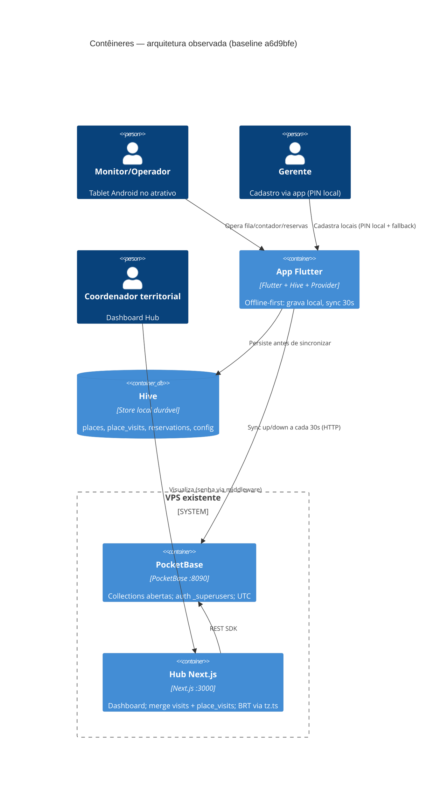
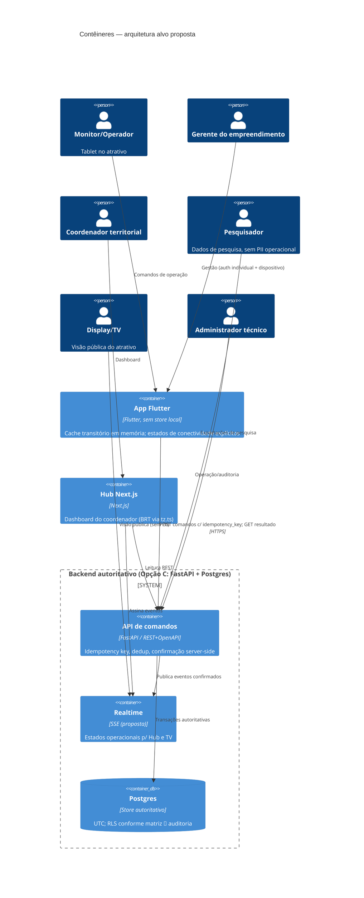
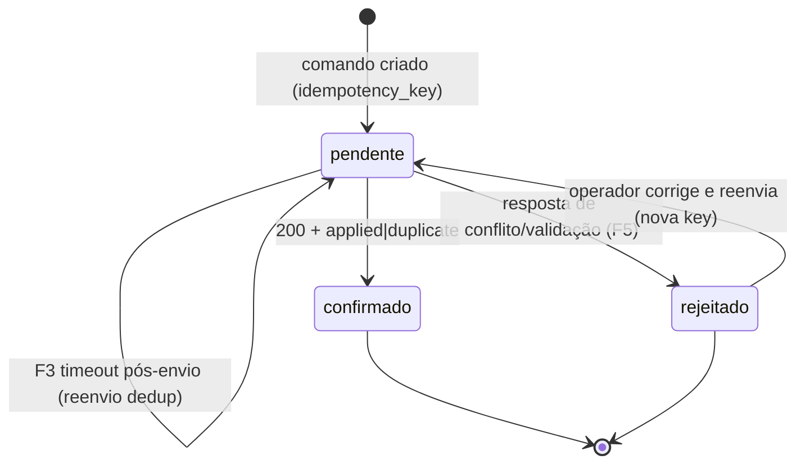

# ADR 0001 — Diagramas C4 (contêineres)

Referenciado por [`0001-authoritative-backend.md`](./0001-authoritative-backend.md).
Renderizável como Mermaid no GitHub. `PROPOSED` — descreve o alvo; o observado
espelha o checkout `main @ a6d9bfe`.

## Arquitetura observada (baseline)

## Arquitetura alvo (proposta — Opção C referência)

## Ciclo de vida do comando (confirmação server-side)

> `pendente` nunca é apresentado como "salvo". Restart descarta `pendente`
> (§4 da ADR); recuperação via consulta de resultado por chave natural.
